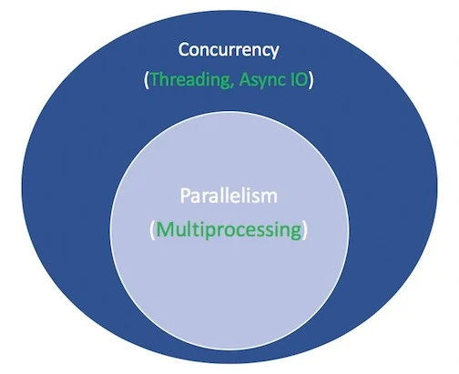

## ASYNCIO

- asyncio - implementation of concurrent programming paradigm in Python


## ASYNC IO

- it's a language agnostic design of asynchronous IO
- it's a library to write concurrent code
- it uses a single thread and a single CPU
- it's IO is a single-threaded, single process design, it uses cooperative multitasking
- it's IO gives a feeling of concurrency despite using thread in a single process
- it's IO is a style of concurrent programming, but it is not parallelism
- it's more closely alligned with threading than we multiprocessing but is very much distinct from both of these and is a standalone member in concurrency's bag of tricks

## PARALLELISM

- parallelism constists of performing multiple operations at the same time
- parallelism is a specific type of concurrency

## MULTIPROCESSING

- multiprocessing is a means to effect parallelism, and it entails spreading tasks over the computer's central processing units (CPUs, or cores)
- multiprocessing is well suited for CPU-bound tasks: tighly bound 'for loops' and mathematical computations
- `multiprocessing` library

## CONCURRENCY

- concurrency is a slightly broader term than parallelism
- concurrency encompasses both multiprocessing (suitable for CPU-bound tasks) and threading (suitable for I/O bound tasks)
- it suggests that multiple tasks have the ability to run in overlapping manner




# THREADING

- threading is a concurrent execution model whereby multiple threads take turns executing tasks
- one process can contain multiple threads
- Python has a complicated relatioship with threading because of GIL
- better suited for I/O bound tasks (http requests, calls to database, testing databases)
- `threading` library, `concurrent.futures` library

## THETA - TIGHT BOUND

Big O is the upper bound, while Omega is the lower bound. Theta requires both Big O and Omega, so that's why it's referred to as a tight bound (it must be both the upper and lower bound).

For example, an algorithm taking Omega(n log n) takes at least n log n time, but has no upper limit. An algorithm taking Theta(n log n) is far preferential since it takes at least n log n (Omega n log n) and no more than n log n (Big O n log n).

<https://stackoverflow.com/questions/464078/what-is-the-difference-between-lower-bound-and-tight-bound>

## I/O BOUND

- I/O bound refers to a condition in the time it takes to complete a computation is determined principally by the period spent waiting for input/output operations to be completed
- this circumstance arises when the rate at which data is requested is slower than the rate it is consumed (more time is spect requesting data than processing it)
- this is the opposite of task being CPU bound (this is a processing task tightly bound to a local CPU and not dependent on external factors like requesting time)

## WHAT DOES ASYNCHRONOUS MEAN?

- asynchronous routines are able to "pause" while waiting on their ultimate result and let other routines run in the meantime
- asynchronous code throught the pause mechanism facilites concurrent execution

## ASYNCHRONOUS CHESS

- a pro player plays 5 games at the same time, he makes a move, time will pass........... before he can make another move, so he uses this time.......... to play 2nd, 3rd or maybe even 4th and 5th time, once his opponenets makes a move, he can return to the table and makes another move

## SYNCHRONOUS CHESS

- a pro player plays 1 game at the time, he only moves to the second game if he finished the first one
- time when his opponents are waiting is wasted, and this is why synchronous processing takes much more time if there is waiting for IO involved

## SIMPLE EXAMPLE ASYNCIO AT WORK

Input:

```python
import asyncio

async def count():
    print('One')
    await asyncio.sleep(1)
    print('Two')

async def main():
    await asyncio.gather(count(), count(), count())

if __name__ == "__main__":
    import time
    s = time.perf_counter()
    asyncio.run(main())
    elapsed = time.perf_counter() - s
    print(f"{__file__} executed in {elapsed:0.2f} seconds.")
```

Output:

```
$ python3 countasync.py
One
One
One
Two
Two
Two
countasync.py executed in 1.01 seconds.
```

## COROUTINE

- coroutines are preferred way of writing asyncio applications
- coroutine is a specialized generator function
- coroutines can be scheduled concurrently but they are not inherently concurrent
- couroutine is a function that can suspend its execution before reaching return, and it can indirectly pass control to another coroutine for some time

## COROUTINES - PRACTICALS

- simply calling a coroutine will not schedule it to be executed

```python
import asyncio

async def main():
  print('hello')
  await asyncio.sleep(1)
  print('world')

main() 
# <coroutine object main at>
```

- in order to schedule a coroutine for execution you have to add either run a Runner and add the coroutine or use `await coroutine()` inside of another coroutine which was already added to the runner

```python
import asyncio
import time

async def say_after(delay, what):
  await asyncio.sleep(delay)
  print(what)

async def main():
  print(f"started at {time.strftime('%X')}")

  await say_after(1, 'hello')
  await say_after(2, 'world')

  print(f"finished at {time.strftime('%X')}")

# OUTPUT
#started at 17:13:52
#hello
#world
#finished at 17:13:55
```


## SYNCHRONOUS AND ASYNCHRONOUS SLEEP

- synchronous, blocking `time.sleep(10)`
- asynchronous, non-blocking `await asyncio.sleep(10)`

## `async def` SYNTAX

`async def` introduces either a native coroutine or an asynchronous generator

## `await` KEYWORD

`await` passes function control back to the event loop (it suspends the execution of the surrounding coroutine)

- if Python encounters an `await f()` expression in the scope of `g()`, this is how `await` tells the event loop, 'Suspend execution of `g()` until whatever I'm waiting on - the result of `f()` - is returned. In the meantime, go do something else."

```python
async def g():
    r = await()
    # Pause here and come back to g() when f() is ready

    return r
```

## RULES WHEN `await` and `async` CAN AND CAN'T BE USED

A function that you introduce with `async` is a coroutine. It may use `await`, `return` or `yield` but all of these are optional. Declaring `async def noop(): pass` is valid
- Using `await()` and/or `return` creates a coroutine function. To call a coroutine function, you must `await` it to get its results
- It is less common (and only recently legal in Python) to use `yield` in an async def block. This creates an asynchronous generator, which you iterate over with `async for`
- Anything defined with `async def` may not use `yield from`, which will raise `SyntaxError`

## ASYNC GENERATOR

```python
async def g(x):
    yield x
```

## AWAITABLE OBJECTS

We say that an object is `awaitable` if it can be used in `await` expression. Many asyncio APIs are designed to accept awaitables.

There are three main types of awaitables:
1. Coroutines
2. Tasks
3. Futures

Example: coroutines, nested coroutines

```python
async def nested():
    return 42

async def main():
    # Nothing happens if we just call "nested()".
    # A coroutine object is created but not awaited,
    # so it *won't run at all*.
    nested()

    print(await nested())

asyncio.run(main())
```

Example: tasks

```python
async def nested():
    return 42

async def main():

```

## GENERATOR-BASED COROUTINE

- old, deprecated since Python 3.5 way of creating coroutines is with decorators

```python
@asyncio.coroutine
def fun(x):
    yield from stuff()
```

## RUNNERS

- runners are high-level API wrapper around event loops with the aim to simplify async code for common wide-spread scenarios

## `asyncio.run()` 

- `asyncio.run()` creates a new event loop, runs coroutines passed to it as arguments and closes the event loop at the end
- it should be used as a main entry point for asyncio programs, and should ideally only be called once
- this function cannot be called if another asyncio event loop is running in the same thread

```python
async def main():
    await asyncio.sleep(1)
    print('hello')

asyncio.run(main())
```

## `asyncio.Runner()`

- a context manager that simplifies muliple async function calls in the same context

```python
async def main():
    await asyncio.sleep(1)
    print('hello')

with asyncio.Runner() as runner:
    runner.run(main())
```

## METHOD OF `asyncio.Runner()`

`runner.run(coro, *, context=None)` - runs the `coro` in the embedded loop, returns the coroutine's result or raise an exception, an optional keyword-only `context` argument allows specyfing a custom `contextvars.Context` for the `coro` to run in. The function cannot be called if another asyncio event loop is running in the same thread.

`runner.close()` - close the runner

`runner.get_loop()` - return the event loop associated with the runner instance

## `asyncio.gather()`

`gather(*aws, return_exceptions=False) -> Future[tuple[()]]`

- `aws` is a sequence of awaitable objects. If any object in the `aws` is a coroutine, the `asyncio.gather()` will automatically schedule it as a task

- if an exception occurs in an awaitable object, it is immediately propagated to the task that awaits on `asyncio.gather()`. Other awaitables will continue to run and won't be cancelled.

- returns the results of awaitables as a tuple with the same order as you pass the awaitables to the function

- if `gather()` is cancelled, all submitted awaitables (that have not completed yet) are also cancelled

- if any Task or Future from the awaitables sequence is cancelled, it is treated as if it raised `CancelledError` - the `gather()` call is not cancelled in this case. This is to prevent the cancellation of one submitted Task/Future to cause other Tasks/Futures to be cancelled

Example:

```python
import asyncio

async def call_api(message, result, delay=3):
    print(message)
    await asyncio.sleep(delay)
    return result

async def main():
    a, b = await asyncio.gather(
        call_api('Calling API 1', 1),
        call_api('Calling API 2', 2)
    )
    print(a,b)

asyncio.run(main())
```

## HANDLING KEYBOARD EXCEPTIONS

- CTRL+C will cancel running task, asyncio will raise `asyncio.CancelledError` and later it will also raise `KeyboardInterrupt`
- keyboard cancellations are executed using special implementation of `signal.SIGINT`, which is a signal from keyboard to the runner

## FUTURE

- `Future` is a container the result of asynchronous operation (eg. coroutine), similar to JavaScript's Promise
- `Future` represents an eventual result of an asynchronous operation
- it's an awaitable object
- coroutines can await on Future objects until they either have a result or an exception set, or until they are cancelled. A Future can be awaited multiple times and the result is same.
- Typically Futures are used to enable low-level callback-based code to interoperate with high-level async/await code

<https://docs.python.org/3/library/asyncio-future.html#asyncio.Future>

## TASK - `asyncio.Task()`

- `Task` is a subclass of `Future` that executes coroutines
- tasks are used to run coroutines in event loops

## `asyncio.TaskGroup`

- an asynchronous context manager holding a group of tasks
- tasks can be added to the group using `create_task()`
- all tasks are awaited when the context manager exists

```python
async def main():
    async with asyncio.TaskGroup() as tg:
        task1 = tg.create_task(coro1)
        task2 = tg.create_task(coro2)
    print('Both tasks have completed now.)
```

- the `async with` statement will wait for all tasks in the group to finish
- while waiting, new tasks may still be added to the group (for example, by passing `tg` into one of the coroutines and calling `tg.create_task()` in that coroutine)
- once the last task has finished and the `async with` block is exited, no new tasks may be added to the group

Exceptions Handling:
- the first time any of the tasks belonging to the group fails with an exception other than `asyncio.CancelledError`, the remaining tasks in the group are cancelled. No further tasks then can be added to the group

<https://docs.python.org/3/library/asyncio-task.html?highlight=asyncio%20gather#asyncio.TaskGroup>


## THREAD-SAFE

Thread-safe means:
- a piece of code is safe-thread if it functions correctly during simultaneous execution by multiple threads
- in particular, it must satisfy the need for multiple threads to access the same shared data
- and the need for a shared piece of data to be accessed by only one thread at any given time

<https://learn.microsoft.com/en-us/archive/blogs/ericlippert/what-is-this-thing-you-call-thread-safe>

## RESEARCH

<https://docs.python.org/3/library/asyncio.html>

<https://superfastpython.com/python-asyncio/>

<https://realpython.com/python-concurrency/>

<https://realpython.com/async-io-python/>

<https://docs.python.org/3/library/asyncio-future.html#asyncio.Future>

<https://www.pythontutorial.net/python-concurrency/python-asyncio-create_task/>