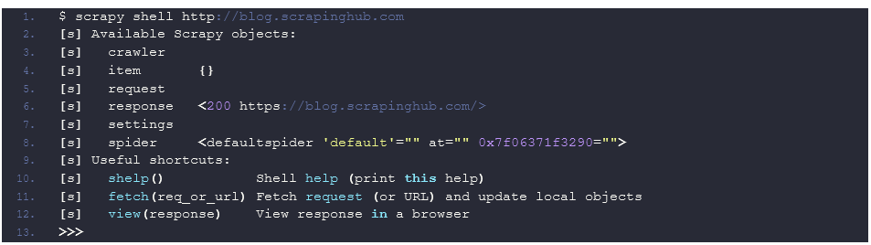

## SCRAPING

## IMPORTANT

- browsers and XML only support XPATH version 1.0
- remember to turn off JavaScript in browser's dev tools if you want to see how Scrapy sees the website
- if you use XPATH selector against another XPATH selector, you should add dot in front of '//', like this `.//`
- you can't use `fetch` command from code, it only works for the console
- `ValueError: Missing scheme in request url:` means that scrapy doesn't know whether it should use http or https
- `DEBUG: Filtered offsite request` warning happens when there is extra slash at the end of the `allowed_domains` variable, `allowed_domains = ["www.worldometers.info/"]`, get rid of it
- if a website which you want to scrape is not available online anymore, you can use `web.archive.org` on a specific date
- when creating a spider, remember to remove `https://` part from the url,
`scrapy genspider my_spider www.tinydeal.com.hk`
- if you export your items as JSON, for example with `-o items.json`, by default, Scrapy will as well write `\uXXXX` escape sequences in JSON strings of the different items. It's the same as how Python 2.7 represent non-ASCII characters, and that's 100% valid JSON output, and is actually the default for Python's json module (referred to as ensure_ascii).
- `body` object of `response` object is in binary format, `text` object is whatever encoding the website is using, unless `FEED_EXPORT_ENCODING = 'utf-8'` is added to scrapy's `settings.py` file
- `ipython` shell doesn't work when running `inspect_response` to debut in a shell because `asyncio` doesn't support nested asyncio loops which is required to run `inspect_response` and `ipython` together

## WHAT CAN BE SCRAPED FROM THE WEB?

- html
- images
- videos
- emails

## SCRAPY COMPONENTS

1. Spiders
2. Pipelines
3. Middlewares
4. Engine
5. Scheduler

## SPIDERS

5 types of spiders are available in Scrapy

1. scrapy.Spider (basic template)
2. CrawlSpider
3. XMLFeedSpider
4. CSVFeedSpider
5. SitemapSpider

Spiders see websites without JavaScript

## BASIC TEMPLATE

`scrapy.Spider`

- requires `name`, `allowed_domains`, `start_requests` property or method and at least one `parse` method

## CRAWL SPIDER

- Crawl Spider is suitable when there are are lot of links fo follow or in case you want to go through subdirectories

## CREATE A CRAWL SPIDER FROM COMMAND

`scrapy genspider -t crawl name_of_spider url.com`

## PIPELINES

- cleaning the data
- remove duplicates
- storing data

## MIDDLEWARES

Request/Response related. Can do things like injecting custom headers or proxying.

- Downloader Middleware (responsible for handling requests)
- Spider Middleware (responsible for extracting data)

## ENGINE

Responsible for coordinating of all other components

## SCHEDULER

Responsible for order of operations in time.
Queue data structure

## `robots.txt`

`robots.txt` gives guidelines to the spider and tell them whether they wanted to be scraped or not, and how

1. `User-Agent` - identity of the spider
2. `Allow` - specifies which pages are allowed for spiders
3. `Disallow` - which pages are forbidden for spiders

Example:

<https://facebook.com/robots.txt>

## SCRAPY COMMANDS

`scrapy bench` - runs a quick benchmark test see to see how fast scrapy is requesting pages at this point of time

`scrapy fetch http://google.com` - get raw HTML markup of a page

`scrapy genspider` - generates a new spider using pre-defined templates

`scrapy runspider` - run a self-contained spider (without creating a project)

`scrapy settings`

`scrapy shell` - useful for debugging, and HTML exploration

`scrapy startproject`

`scrapy view http://google.com` - open URL in browser, as seen by Scrapy

## CREATE A NEW SCRAPY PROJECT

`scrapy startproject project_name`

## FETCHING URLS FROM SHELL

`fetch('https://www.worldometers.info/world-population/population-by-country/')`

## SCRAPY REQUEST OBJECT

`r = scrapy.Request(url='https://www.worldometers.info/world-population/population-by-country/')`

`fetch(r)`

## GET THE RESPONSE BODY

`response.body`

## HOW TO OPEN DEV TOOLS IN CHROME WITH SHORT-CUT?

Ctrl+Shift+I

## HOW TO OPEN COMMAND LINE IN CHROME DEV TOOLS?

Ctrl+Shift+P

## HOW TO REFRESH PAGE WITH SHORT-CUT IN CHROME?

Ctrl+R

## FETCHING A SINGLE HTML ELEMENT USING XPATH SELECTOR

```python
title = response.xpath('//h1/text()')
title.get() # will return XPATH selector object [<Selector xpath='descendant-or-self::h1/text()' data='Countries in the world by population ...'>]
```

## FETCHING A SINGLE HTML ELEMENT USING CSS SELECTOR

```python
title_css = response.css("h1::text")
title_css.get() # will ALSO return XPATH selector object [<Selector xpath='descendant-or-self::h1/text()' data='Countries in the world by population ...'>]
```

## FETCHING A COLLECTION OF HTML ELEMENTS USING XPATH SELECTOR

```python
countries = response.xpath('//td/a/text()').getall() # returns a Python list of countries
```

## FETCHING A COLLECTION OF HTML ELEMENTS USING CSS SELECTOR

```python
countries_css = response.css('td a::text').getall()
```

## `scrapy.Spider` OBJECT

- we return data from `scrapy.Spider` as a dictionary

## CSS SELECTORS

## SELECT BY CLASS

`.my_class`

## SELECT BY ID

`#my_id`

## SELECT BY TAG ELEMENT

`tag_element`

## SELECT AN ELEMENT OF A SPECIFIC CLASS

`tag_element.my_class`

## SELECT AN ELEMENT WITH A SPECIFIC ID EXPLICITLY

`tag_element#my_id`

## SELECT AN ELEMENT WHICH IS AN INSTANCE OF TWO CLASSES

`.first_class.second_class`

## SELECT AN ELEMENT WITH A CUSTOM ATTRIBUTE

`[data-identifier]`
`[data-identifier=7]`
`li[data-identifier=7]`

## CONDITIONAL CSS SELECTOR

## SELECT ONLY IF AN ATTRIBUTE STARTS WITH X - `^` SIGN

- similarly like in regex, use `^` carret sign

`a[href^='https']` - select an `<a>` element with attribute which starts with 'https'

## SELECT ONLY IF AN ATTRIBUTE ENDS WITH X - `$` SIGN

- similarly like in regex, use `$` dollar sign

`a[href$='fr']` - select an `<a>` element with attribute which ends with 'fr'

## SELECT ONLY IF AN ATTRIBUTE HAS X IN THE MIDDLE - `*` SIGN

`a[href*='google']`- select an `<a>` element with attribute which contains 'google' string

## SELECT ELEMENTS WHICH CONTAINED WITHIN A DIV TAG

`div.class_name p` - selects all `<p>` tags inside of a class_name div

## SELECT ELEMENTS WHICH ARE NOT CONTAINED WITHIN A DIV TAG BUT ARE HIS DESCENDANTS

`div.class_name span#location` - selects `<span>` elements which are descendants of `<div class='class_name`>`

## SELECT ELEMENTS WHICH CONTAINED WITHIN A DIV TAG AND HIS DESCENDANTS

`div.class_name p, span#location`

## SELECT ALL CHILDREN OF AN TAG

`div.class_name > p` - selects all `<p>` which are children of `<div class=class_name>`

## SELECT TAGS OF A SPECIFIC TAG WHICH ARE PLACED IMMEDIATELY OUTSIDE OF A SPECIFIC TAG

- only works for the elemenent which is placed IMMEDIATELY after `</div>`

`div.class_name + p` - selects the first `<p>` tag which is placed after `</div>`

## SELECTING NTH CHILD

- indexing starts with 1

`li:nth-child(1)`

## SELECTING MULTIPLE NTH CHILDREN

`li:nth-child(1), li:nth-child(3)`

## SELECTING ODD OR EVEN NTH CHILDS

`li:nth-child(odd)`
`li:nth-child(even)`

## SELECT SIBLING ELEMENTS WHICH FOLLOWS LATER EVEN IF IT DOESN'T FOLLOW IMMEDIATELY. SIBLING COMBINATOR

`li ~ a`
`h1 ~ p`

## XPATH = XML PATH LANGUAGE

## SELECT AN ELEMENT WITH A SPECIFIC ATTIBUTE (CAN BE A CLASS, ID OR CUSTOM ATTRIBUTE)

`//div[@class='intro']`
`//p[@id='tom']`
`//li[@data-identifier='7']`

## SELECT A CHILD OF AN ELEMENT TAG

`//div[@class='intro']/p[@id='outside']`

## OR OPERATOR

`//div[@class='intro' or @class='outro']/p` - select all `<p>` elements which are children or either `<div class='intro>` or `<div class='outro'>` tags

## SELECT TEXT FROM TAGS - `/text()`

`//div[@class='intro' or @class='outro']/p/text()` 

## SELECT HREF ATTRIBUTES OF `<a>` ELEMENTS

`//a/@href`

## `starts-with()`

- function takes two arguments
- this function is only supported by `XPATH v 2.0`

`//a[starts-with(@href, 'https')]`

## `ends-with()`

`//a[ends-with(@href, 'fr')]`

## `contains` - SHOW ONLY ELEMENTS WHERE `href` CONTAINS A CERTAIN STRING

- it's case sensitive

`//a[contains(@href, 'google')]`

## SELECT ONLY ELEMENTS WHERE `text` CONTAINS A CERTAIN STRING

- it's case sensitive

`//a[contains(text(), 'France')]`

## SELECT ELEMENT BY ORDER

- indexing starts with 1

`//ul[@id='items']/li[1]`

## SELECT MULTIPLE ELEMENTS BY ORDER

`//ul[@id='items']/li[position() = 1 or position() = 4]` - selects first and fourth item

## SELECT LAST ITEM FROM A LIST OF ELEMENTS

`//ul[@id='items']/li[last()]`
`//ul[@id='items']/li[position() = 1 or position() = last()]`

## USING MATHEMATICAL OPERATORS TO SELECT MULTIPLE ITEMS

`//ul[@id='items']/li[position() > 2]`

## USING `position()` AND `and` AND `contains` TOGETHER

`//li[position() = 1 and contains(@text. 'hello')]`

## AXIS

- Axis represents a relationship ot the current context, and is used to locate nodes relative to that node on the tree
- axis elements: `ancestor`, `child`, `parent`, `self` etc

## SELECT A PARENT ELEMENT OF TYPE `<DIV>`

`//p[@id='unique']/parent::div`

## SELECT A PARENT ELEMENT OF ANY TYPE

`//p[@id='unique']/parent::node()`

## SELECT ALL ANCESTOR OF A NODE (A PARENT, GRANDPARENT, ETC)

`//p[@id='unique']/ancestor::node()`

## SELECT ALL ANCESTOR OF A NODE AND THE NODE ITSELF

`//p[@id='unique']/ancestor-or-self::node()`

## SELECT ALL ELEMENTS PRECEDING A NODE WHICH ARE ON THE SAME AXIS LEVEL (SO ONLY SIBLINGS)

`//p[@id='unique']/preceding:node()` - it will return all elements preceding p which are on the same axis level

`//p[@id='unique']/preceding:div` - it will return all `<div>` elements preceding `<p id='unique'>` which are on the same axis level as `<p id='unique'>`

## SIBLING

- two elements are siblings if they share the same parent

Example:

```html

<p id='not_a_sibling1'>

<div id='father'>

  <p id='sibling1'>
  <p id='sibling2'>

</div>

<p id='not_a_siblin2>
```

## SELECT ALL PRECEDING SIBLINGS

`//p[@id='sibling2']/preceding-sibling::p`

## SELECT TAG SPECIFIC CHILD ELEMENT OF A NODE

`//div[@class='intro']/child::p` - select all children of `<div class='intro'>` of type `<p>`

Syntactic sugar for the same selector is:

`//div[@class='intro']/p`

## SELECT ALL CHILD ELEMENTS OF A NODE

`//div[@class='intro']/child::node()` or `//div[@class='intro']/node()`

## SELECT ALL ELEMENTS FOLLOWING A PARTICULAR NODE WHICH ARE ON THE SAME AXIS

`//div[@class='intro']/following:node()`

## SELECT ALL SIBLING ELEMENTS OF A PARTICULAR NODE WHICH ARE FOLLOWING THE NODE

`//div[@class='intro']/following-sibling:node()`

## SELECT ALL DESCENDENTS OF A NODE

`//div[@class='intro']/descendent::node()`

## REMOVE ALL LEADING AND TRAILING SPACE

`normalize-space()`

`normalize-space((//time)[1]/text())`

## PREDICATE

- predicate is a condition
- predicate is everything which we write inside the square bracket

## CONCATENATE ROOT URL WITH PAGE URL USING `response.urljoin(link)`

```python
full_url = response.urljoin(single_page_url)
```

Another way:

```python
yield response.follow(url=single_page_url)
```

## PAGINATIONS

- automatic way of dealing with paginations can be done using `lastPage` class on the paginations

Here is the procedure:

1. Request page 1
2. Scrape all needed information
3. Update the `url` based on the href in `nextPage` class
3. Check if if the `url` exists
4. If it exists make another request to the next page. If it doesn't exists, it means that `nextPage` doesn't exists on the current page, so we are on the last page.
5. Yield

```python
class SpecialOffersSpider(scrapy.Spider):
    name = "special_offers"
    allowed_domains = ["web.archive.org"]
    start_urls = ["https://web.archive.org/web/20190225123327/https://www.tinydeal.com/specials.html"]

    def parse(self, response):
        
        products = response.xpath('//div[@class="r_b_c"]/ul[@class="productlisting-ul"]/div[@class="p_box_wrapper"]/li[@class="productListing-even"]')

        for product in products:
          name = product.xpath('.//a[@class="p_box_title"]/text()').get()

          yield {'name': name}
          
        next_page = response.xpath("//a[@class='nextPage]/@href").get()

        if next_page:
           yield scrapy.Request(url=next_page, callback=self.parse)
```

## FEEDS

```python
# settings.py 

FEEDS = {
    'data.json': {'format': 'json'}
}
```

Feeds are settings which describe how scrapy will save the scraping results to local files.

<https://scrapeops.io/python-scrapy-playbook/scrapy-save-json-files/>

## SPOOFING REQUEST HEADERS

1. Update `USER_AGENT` in `settings.py` file. Congiguration level settings, so it applies to all requests sent by scrapy.
2. Update `DEFAULT_REQUEST_HEADERS` in `settings.py`. Also configuration level update. Doesn't offer any difference to option 1 besides some time savings if you want to update multiple request headers.
2. Update `request.header.user-agent` in the `Request` class. This aption allows dynamic update.

## OPTION 1 - UPDATE `USER_AGENT` CONSTANT

1. Go to browser dev tools
2. Open 'Network' tab
3. Pick any 'html' file from 'Name' column
4. In 'Headers' section, find 'Request Headers' subsection
5. Copy 'user-agent' string value
6. Go to your projects' `settings.py`
7. Update `USER_AGENT` variable with the browser's user agent string, eg. 
`Mozilla/5.0 (Windows NT 10.0; Win64; x64) AppleWebKit/537.36 (KHTML, like Gecko) Chrome/111.0.0.0 Safari/537.36`

## OPTION 2 - UPDATE `DEFAULT_REQUEST_HEADERS`

- follow steps defined in option 1 but update `DEFAULT_REQUEST_HEADERS` instead of `USER_AGENT`

```python
DEFAULT_REQUEST_HEADERS = {
  'User-Agent': 'Mozilla/5.0 (Windows NT 10.0; Win64; x64) AppleWebKit/537.36 (KHTML, like Gecko) Chrome/111.0.0.0 Safari/537.36'
}
```

## OPTION 3 - UPDATE 

```python
class SpecialOffersSpider(scrapy.Spider):
    name = "special_offers"
    allowed_domains = ["web.archive.org"]
    #start_urls = ["https://web.archive.org/web/20190225123327/https://www.tinydeal.com/specials.html"]

    def start_requests(self):
        yield scrapy.Request(url='https://web.archive.org/web/20190225123327/https://www.tinydeal.com/specials.html',
                             callback=self.parse,
                             headers={
                                 'user-agent': 'Mozilla/5.0 (Windows NT 10.0; Win64; x64) AppleWebKit/537.36 (KHTML, like Gecko) Chrome/111.0.0.0 Safari/537.36'
                             })

    def parse(self, response):

        products = response.xpath(
            '//div[@class="r_b_c"]/ul[@class="productlisting-ul"]/div[@class="p_box_wrapper"]/li[@class="productListing-even"]')

        products = products[:2]

        for product in products:
            name = product.xpath('.//a[@class="p_box_title"]/text()').get()
            link = product.xpath('.//a[@class="p_box_title"]/@href').get()
            special_price = product.xpath(
                './/div[@class="p_box_price"]/span[@class="productSpecialPrice fl"]/text()').get()
            normal_price = product.xpath(
                './/div[@class="p_box_price"]/span[@class="normalprice fl"]/text()').get()

            yield {'name': name,
                   'link': link,
                   'special_price': special_price,
                   'normal_price': normal_price,
                   'User-Agent': response.request.headers['User-Agent']}

        next_page = response.xpath("//a[@class='nextPage']/@href").get()

        if next_page:
            yield scrapy.Request(url=next_page, callback=self.parse, headers={
                'user-agent': 'Mozilla/5.0 (Windows NT 10.0; Win64; x64) AppleWebKit/537.36 (KHTML, like Gecko) Chrome/111.0.0.0 Safari/537.36'
            })
```

## DEBUGGING

Simplest method of debugging is just `prinat(variable)` inside the callback method.

## DEBUGGING FROM SCRAPY SHELL - `scrapy shell url`

- this command will recognize a specific spider and a callback method associated with the passed url
- spider will send a request and stop at the begining of the callback method giving you request context, so you can test your callback method processing from the shell
- scrapy will suggest what objects are currently available like (`crawler`, `response`, `spider`, etc)



You can test these commands in the shell by:

`response.xpath('//div[@class='input']).get()`

## OPENING A SCRAPY SHELL AT A SPECIFIC LINE OF CALLBACK METHOD EXECUTION - `scrapy.shell.inspect_response`

- place `inspect_response()` function inside your callback method and run the spider from the shell

```python
from scrapy.shell import inspect_response
 
def BlogSpider(scrapy.Spider)
    ...
    def parse(self, response):
        if len(response.css('div.post-header > h2 ::text')) > EXPECTED:
            # generate the items
        else:
            inspect_response(response, self)
        ...
```

## FETCH COMMAND - FETCH HTML AND SAVE IT TO A HARD DRIVE OR INSPECT IN THE CONSOLE

`scrapy fetch http:/myblog.com > blog.html`

## `parse` COMMAND

- `parse` command allows you to debug a specific spider, specific callback method for a specific url
- it's useful when you want to isolate from the full workflow

`scrapy parse --spider=my_spider -c parse_item -d 2 <item_url>`

`scrapy parse --spider=countries -c parse_country --meta='{"country_name":"China"}'  https://www.worldometers.info/world-population/china-population/`

- 'c' argument is a callback method
- 'd' argument is depth

<https://docs.scrapy.org/en/latest/topics/debug.html>

## POST-MORTEM DEBUGGING

- debugging an execution which has already closed, like analysing log files, calls stack of the crash and analysis of memory dump

`scrapy crawl blog -d blog_items.jl --pdb`

## DEBUGGING IN VS CODE

Add a file called `runner.py` in the project folder.

Add this code to the file:

```python
import scrapy
from scrapy.crawler import CrawlerProcess
from scrapy.utils.project import get_project_settings
from worldometers.spiders.countries import CountriesSpider

process = CrawlerProcess(settings=get_project_settings())
process.crawl(CountriesSpider)
process.start()
```

Select a line to stop debugger by placing a red dot on the line.

Click F5 to start debugging.

## OTHER DEBUGGING OPTIONS

<https://docs.scrapy.org/en/latest/topics/debug.html>

<https://www.zyte.com/blog/scrapy-tips-from-the-pros-may-2016-edition/>

## DEPTH

- depth is the number of consecutive requests (on new url) which spider is going to crawl

## RULES

- order of rules matter

How this works:

1. Use `LinkExtractor` from Rule 1 to request each page which is an item of `restrict_xpaths` list
2. On each succesful request from the list, parse it and yield it
3. After each item from the list was requested and parsed, execute Rule 2
4. Rule 2 extracts 'NextPage' link from the page and requests that page
5. Then Rule 1 is executed again, this time on the requested 'NextPage'
6. Looping over Rule 1 and Rule 2 will continue until there are no more 'NextPage' urls, which is the last page of the pagination.

```python
class BooksSpider(CrawlSpider):
    name = 'books'
    allowed_domains = ['books.toscrape.com']
    start_urls = ['http://books.toscrape.com']

    rules = (
        Rule(LinkExtractor(restrict_xpaths="//article[@class='product_pod']/div/a"), callback='parse_item', follow=True),
        Rule(LinkExtractor(restrict_xpaths="//li[@class='next']/a"))
    )

    def parse_item(self, response):
        yield {
            'title': response.xpath("//div[@class='col-sm-6 product_main']/h1/text()").get(),
            'price': response.xpath("(//div[@class='col-sm-6 product_main']/p)[1]/text()").get()
        }
```

## HOW TO OPEN A SCRAPED RESPONSE IN A BROWSER?

```python
from scrapy.utils.response import open_in_browser
open_in_browser(response)
```

## HOW TO SAVE SCRAPED DATA TO A FILE FROM CONSOLE?

`scrapy crawl my_spider -o my_file.json`

## HOW TO TEST XPATH IN FIREFOX?

1. Go to console
2. `$x('//p[@id='my_p']')`

## INTEGRATING DJANGO AND SCRAPY USING SCRAPYD

<https://scrapeops.io/python-scrapy-playbook/extensions/scrapy-scrapyd-guide/>

## USEFUL TOOLS

## HTTP 1.1 SPECIFICATIONS - HTTP CODES, ETC

<https://www.rfc-editor.org/rfc/rfc2616>

## TINKERING WITH XPATH ANC CSS

<https://try.jsoup.org>

## XPATH PLAYGROUND

<https://scrapinghub.github.io/xpath-playground/>

## XPATH CHEATSHEET

<https://devhints.io/xpath>

## CSS SELECTORS CHEATSHEET

<https://www.freecodecamp.org/news/css-selectors-cheat-sheet/>

## HOW TO ESCAPE DIFFERENT ENCODING SPECIAL CHARACTERS?

<https://stackoverflow.com/questions/33816875/lxml-xpath-doesnt-ignore-nbsp/33829869#33829869>

## HOW SCRAPY TREATS UNICODE CHARACTERS AND ENCODING TO JSON

<https://stackoverflow.com/questions/44128899/inappropriate-encoding-of-response-of-scrapy>

## `RuntimeError: This event loop is already running` ISSUE

<https://medium.com/@vyshali.enukonda/how-to-get-around-runtimeerror-this-event-loop-is-already-running-3f26f67e762e>

## PASSING META DATA IN YOUR SPIDER

<https://www.attilatoth.dev/posts/scrapy-meta/>

## STACKOVERFLOW POWER USERS

<https://stackoverflow.com/users/2572383/paul-trmbrth>
<https://stackoverflow.com/users/149872/elias-dorneles>
<https://stackoverflow.com/users/939364/gallaecio>