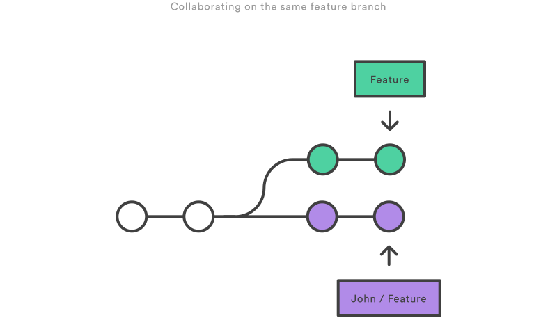
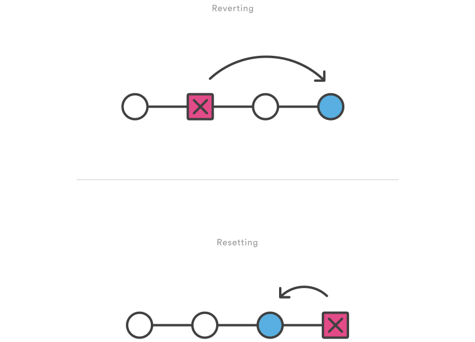

# GIT AND GITHUB

## MAIN COMPONENTS OF GIT REPOSITORY


## CREATE A NEW REPOSITORY

`git init`

## CREATE A NEW BRANCH

`git branch fib-implementation`

## CHANGE TO A DIFFERENT A BRANCH

`git checkout fib-implementation`

## SHOW CHANGES TO FILES

`git status`
`git diff`

## ADD FILES

go to a folder within a project structure you want to be

`cd ./x`

go one folder up

`cd ..`

go to root

`cd /`

go to a specific folder which exists in the current path

`cd folder`

adding a single file

`git add file.py`

adding all files and folders in the koans folder

`git add ./PKG/koans`

adding all files and folders in all folders which start with 'k'

`git add /PKG/*k`

removing a file

`git rm file.py`

## CREATING A COMMIT

`git commit -m 'fib and fib_memo implementation` - m stands for message

## CREATING UPSTREAM BRANCH (ONE CORRESPONDING BRANCH OF A LOCAL BRANCH)

`git push --set-upstream origin fib-implementation` # upstream is a remote equivalent of a local rep

## PUSHING A REPO TO REMOTE

`git push`

## CREATE A PULL REQUEST

- go to github, repo, branch
- click create a pull request

## WHAT IS `origin`

`git push origin branchname`

Origin is an alias (of a remote repository) which stores URL of this repository, it's a convention to call this alias 'origin', to indicate that the reposity came from a remote place, rather than developed locally. Origin is configured in the config file.

In the push command, you can use remotes or you can simply use a URL directly. An example that

uses the URL:

`git push git@github.com:git/git.git master`

## HOW TO CHECK THE URL OF A REPO ALIAS LIKE ORIGIN?

`git remote -v`

origin https://github.com/bartosz-bear/coding-allstars-trial-project.git (push)

## WHAT IS `HEAD`?

HEAD is like a pointer which tells what is the current branch, being developed locally. The current HEAD is local to each repository, and is therefore individual for each developer.

You can check what is head with following command.

`cat .git/HEAD`
ref: refs/heads/master

## HOW TO CHANGE A BRANCH OF A REPOSITORY?

`git checkout branch_name`

## GIT MERGE - MERGING TWO BRANCHES TOGETHER

`git merge target_branch`

Git merge will combine multiple sequences of commits into one unified history.

`receiving_branch` - current branch, the one who will remain after the merge

`target_branch` - the one who can be deleted after the merge

## GIT OBJECT

repository, local repository, remote repository, branch, current branch, receiving branch, target branch, commit, common base commit, merge commit, main tip, feature tip, HEAD, file

## HOW TO DELETE A LOCAL BRANCH?

`git branch -d`

## HOW TO DELETE A REMOTE BRANCH?

`git push -d origin develop/remote_branch`

## WHAT IS A MAIN TIP?

- main tip is the latest commit of a merge receiving branch, which will be used for merge operation
- `git merge` operation assumes the current branch as a merge receiving branch

## WHAT IS A FEATURE TIP?

feature tip is the latest commit of a target branch, which will be merged into the main tip

## WHAT IS A MERGE COMMIT?

merge commit is a commit which was created by running a merge operation

## HOW TO GET THE MOST RECENT REMOTE BRANCH COMMIT?

`git fetch origin/branch_name`

## WHAT IS A FAST-FORWARD MERGE?

Fast-forward merge is an easy merge, where a target branch is added linearly (all commits happen after the latest commit of the receiving branch).

## WHAT IS A 3-WAY MERGE?

3-way merge is used when the receiving branch was changed while the target branch was being developed. This is a common scenario for large features or when several developers are working on a project simultaneously.

## HOW TO EXIT A GIT STATUS LOG SCROLLING?

press 'q'

## HOW CAN I SEE ALL AVAILABLE BRANCHES (BOTH LOCAL AND REMOTE)?

git branch -a

## WHAT IS GIT REBASE?

`git rebase`

Rebase is used to add small changes to the main branch without need for 3-way-merge. Merge is always a forward moving change record. Alternatively, rebase has powerful history rewriting features. Rebase itself has 2 main modes: "manual" and "interactive" mode. Rebase allows to keep a linear history of the branch, therefore makes debugging easier.

## WHAT IS GIT BISECT?

applies a binary search to find the latest working commit

`git bisect start` # starts a binary search and returns the commit nr to check

`git bisect good` # tells git that the commit is working good (bug is not present, therefore it’s not the one we are looking for)

`git bisect bad` # tells git that the commit is not working (bug is present, this is the we are looking for)

`git bisect reset` # resets bisect count so you can use it again later

## DIFFERENCE BETWEEN STAGED AND UNSTAGED VERSIONS

`git diff`

will show the difference between your workspace and the index (the index is where the staged files live). workspace = unstaged files, index = staged files

workspace - code in your IDE/local file index - code which you have git added

`git diff HEAD`

will show difference between workspace and main local repo (latest commit)

`gif diff - - staged` # or - - cached

will show difference between index and your main local repo (latest commit)

## WHAT IS GIT STASH?

`git stash`

Temporarily shelves (or stashes) changes you’ve made to your working copy so you can work on something else, and then come back and re-apply them later on.

- Stashing is handy if you need to quickly switch context and work on something else, but you’re mid-way through a code change and arent’ quite ready to commit.
- By default git won't stash changes made to untracked or ignored files (new files in your working copy which have not been yet staged, file that have been ignored).
- `WIP` - stash symbol (work in progress)
- note that `stash` is local, stashes are not transferred to the server when you push
- Stash is useful for experimentation.

`git stash`

- it will take changes applied from the last commit and put them on a shelf, so they can be applied later
- after git stash, git status will show no change from last commit

`$ git stash Saved working directory and index state WIP on main: 5002d47 our new homepage HEAD is now at 5002d47 our new homepage`

`$ git status On branch main nothing to commit, working tree clean`

## REAPPLYING STASH CHANGES

`git stash pop`

- popping your stash removes the changes from your stash and reapplies them to your working copy
- by default pop will re-apply the most recently created stash

```
git stash pop On branch main Changes to be committed:

new file:   style.css

Changes not staged for commit:

modified:   index.html
```

`git stash pop stash@{2}`

-you can choose which stash to re-apply by passing its identifier as the last argument

## PARTIAL STASHES

`git stash -p`

- you can apply stash to only specific part of your working copy
- git will iterate over all changed blocks of code and will ask you if you want or not to stash that particular change, then you can use the following options to decide:
`?` help n don't stash this hunk
`q` quit (any hunks that have already been selected will be stashed)
`s` split this hunk into smaller hunks y stash this hunk

## ABORTING STASH PROCESS

CTRL+C

## VIEWING STASH DIFFS

`git stash show`
index.html | 1 + style.css | 3 +++ 2 files changed, 4 insertions(+)

`git stash -p`
(or --patch) to see the full view

## HOW DO YOU REAPPLY THE STASH TO YOUR WORKING COPY AND KEEP THE STASH?

`git stash apply`

- this is useful when you want to apply the same stashed changes to multiple branches

## STASHING UNTRACKED FILES

`git stash -u` (or --include-untracked) [only untracked]

`git stash -a` (or --all) [both untracked and ignored]

## MANAGING MULTIPLE STASHES

`git stash list`

`stash@{0}: WIP on main: 5002d47 our new homepage stash@{1}: WIP on main: 5002d47 our new homepage stash@{2}: WIP on main: 5002d47 our new homepage`

## SAVING STASHES WITH A NAME

`git stash save "styling and string formatting"`

`$ git stash list stash@{0}: On main: add style to our site stash@{1}: WIP on main: 5002d47 our new homepage stash@{2}: WIP on main: 5002d47 our new homepage`

## CREATING A BRANCH FROM YOUR STASH

`git stash branch git stash branch add-stylesheet stash@{1}`

- creates a new branch and applies your stash changes to it

https://www.atlassian.com/git/tutorials/saving-changes/git-stash

## CONFIGURATION

`git config`

- convenience function that is used to set configuration values on a global or local scope.

## CONFIGURATION FILES

`.gitconfig`

- global configuration file for git

`.git/config`

- local project configuration file

## CONFIGURATION SCOPES

- when looking for configuration value, git will start at the
1. local level
2. then operating system user level
3. then system system level

`—local`

- by default git config will write to a local level if no configuration option is passed

`—global`

- global level configuration is user-specific, meaning it applies to an operating system user

- global configuration values are stored in a file that is located in a user’s home directory ~ /.gitconfig on unix C:\Users\.gitconfig on windows

`—system`

- system-level configuration is applied accross an entire machine. This covers all users on operating system and all repos.

- system-level configuration file lives in a gitconfig file off the system root path. `$(prefix)/etc/gitconfig` on unix `C:\ProgramData\Git\config` on windows (different for windows server)

## WRITING A VALUE TO CONFIG

`git config —global user.email “your_email@example.com”`

## CONFIG EDITOR

`git config editor`

- many git commands will launch a text editor to prompt for further input
- one of the most common use cases for git config is configuring which editor git should use

`git config —global core.editor "'c:/program files/sublime text 3/sublimetext.exe' -w"`

## HOW TO MAKE VS CODE THE EDITOR FOR GIT COMMITS?

* this script will set up VS Code as default editor for all programs (not only git) for a particular operating system user

- open Powershell as administrator
- `$Env:VISUAL = "code --wait"`
- `$Env:EDITOR = "$VISUAL"`

* this script will set up VS Code as default editor just for git

`git config --global core.editor "code --wait"`

* test if the command works

`git commit --amend`

<https://stackoverflow.com/questions/2596805/how-do-i-make-git-use-the-editor-of-my-choice-for-editing-commit-messages>

## ALIASES

- shortcuts for frequency used git commands a common use case for git aliases is shortening the commit command

`git config —global alias.ci commit` (you will be able to invoke git commit by executing git ci)

- aliases can also reference other aliases to create powerful combos

`git config —global alias.amend ci —amend`

## CONFIGURATION OF MERGE TOOLS

- in the event of a merge conflict, git will launch a merge tool
- by default git uses an internal implementation of the common Unix diff program
- the internal git diff is a minimal merge conflict viewer

`git config —global merge.tool kdiff3`

## CUSTOMIZING COLORED OUTPUTS

`color.ui`

master variable for color values possible values: false, auto, always

`git config —global color.ui false`

setting it to false will disable all git’s colored terminal output, by default its auto, it will omit color code output if the output stream is redirected to a file

## OTHER COLORED OUTPUT EXAMPLES

`git config color.branch green`
`git config color.diff` (applies colors to git diff, git log and git show)
`git config color.log —decorate` (color specific for local branches, remote-tracking branches, stashed changes and HEAD)
`git config color.grep` (applies color to the output of grep)
`git config color.interactive` (examples git add —interactive or git clean —interactive)

## FORMATTING AND WHITESPACE

“whitespaces” features can be configured to highlight issues when using `git diff`

`color.diff.whitespace`

Example features (enabled by default) blank-at-eol - highlights orphan whitespaces at the line endings space-before-tab blank-at-eof - blank line at the end of file

Example features(disabled by default) indent-with-no-tab tab-in-indent trailing-space (both both start and end of line)

## SEARCHING FOR STRINGS IN GIT IDENTIFIED FILES

`git grep`

- specialized version of the famous grep command
- it allows you to search for a given string pattern inside files, finding the lines that match the specified patterns inside files, finding the lines that match the pattern
- it only searches for files that git knows about (tracked by existing commits, added to the stage, exist in the working directory)
- more importantly, git grep allows you to search files in different branches or in different points from the repo’s timeline, this makes the command incredibly powerful and flexible

<https://www.kosli.com/blog/git-grep-like-a-pro-the-complete-guide/>

## HOW TO CHANGE THE URL OF REMOTE REPOSITORY?

`git remote set-url origin "https://github.com/bartosz-bear/web_scraping.git"`

## HOW DO YOU REMOVE THE MOST RECENT COMMIT PUSHED TO THE REMOTE REPO AND KEEP YOUR LOCAL CODE INTACT?


`git push -f origin HEAD^:master`

## WHAT IS `origin`?

Origin is a shorthand name for the remote repository that a project was originally cloned from.

It is used instead of that original repository's URL making referencing much easier.

## WHAT IS `origin/HEAD`?

`origin/HEAD` represents the default branch on a remote and is a local reference representing a local copy of the HEAD in the remote repository.

`origin/HEAD` reference is created automatically during the `clone` process.

## HOW TO CREATE A NEW REFERENCE TO A REMOTE REPOSITORY?

```
git remote add reference_name git@bitbucket.org:user_name/remote_repo_name.git
```

## WHAT IS `DETACHED HEAD` STATE?

In git, `HEAD` refers to the currently checked-out branch's latest commit. However, in a detached `HEAD` state, the `HEAD` does not point to any branch, but a specific commit or the remote repository.

<https://circleci.com/blog/git-detached-head-state/>

## WHAT ARE `TAGS`?

Tags are used to tag a specific point in repository's history. Eg. it's a common practice to tag important commits with versioning tags like `v1.0` or `v2.0`.

<https://git-scm.com/book/en/v2/Git-Basics-Tagging>

## ADDING A TAG

First commit your work. A tag will be assigned to the latest commit.

`git tag -a -m "describing the tag" v1.1`

## LISTING TAGS

`git tag`

## DELETE A TAG

`git tag -d tag_name`

## WHAT DOES CARET `^` CHARACTER MEANS IN GIT?

`HEAD^` means the first parent of the tip of the current branch.

`HEAD^` is a short-cut for `HEAD^1`

<https://stackoverflow.com/questions/1955985/what-does-the-caret-character-mean-in-git>

## COMPARE A LOCAL AND REMOTE REPOSITORY TO SEE DIFFERENCE IN COMMITS BETWEEN THE TWO

`git log main..origin/main`

Or if you only want to see the summary:

`git log --oneline main..origin/main`

## WHAT IS `git fetch` COMMAND?

`git fetch` is similar to `git pull` however `git fetch` is only downloading the latest version of the repository, while `git pull` does two things sequentially: first it runs `git fetch` and immediately after it runs `git merge`.

<https://www.atlassian.com/git/tutorials/syncing/git-fetch>

## FULL MERGING PROCESS

Download the latest version of the remote repo:

`git fetch origin/main`

See the changes between the repos

`git log main..origin/main`

Merge the repo (assuming you are checkout to the local repo)

`git merge origin/main`

## GIT COURSES

COMPREHENSIVE

The Git & Github Bootcamp (Udemy)

FOCUS ON TEAM WORK

Collaborative Coding with Git (FutureLearn)

<https://www.futurelearn.com/courses/collaborative-coding-with-git>

## HOW TO SHOW A USER NAME AND EMAIL?

`git config user.name`

`git config user.email`

## HOW TO VIEW THE GIT CONFIG FILE?

`sudo nano ~/.gitconfig`

## HOW TO CHANGE USER NAME AND EMAIL FOR A PARTICULAR REPO?

Go to the repo directory

`git config user.name = 'new_name'`
`git config user.email = 'new_email@email.com`

## HOW TO CHANGE USER NAME AND EMAIL GLOBALLY (ON THE OPERATING SYSTEM LEVEL)?

`git config --global user.name = 'new_name'`
`git config --global user.email = 'new_email@email.com`

## WHAT IS UPSTREAM AND DOWNSTREAM?

`upstream` is usually a remote repository from which you clone

`downstream` is usually a local repository which you develop and push upstream

## HOW TO PUSH A LOCAL REPO TO A SPECIFIC BRANCH?

`git push -u origin branch_name`

`-u` means upstream

## HOW TO CREATE A BRANCH ON THE REMOTE REPO?

- branches for upstream repos are actually created locally and upon push up they will be created in the remote repo

`git branch new_branch`
`git checkout new_branch`

- add code

`git push --set-upstream origin new_branch`

## HOW TO CHECK IF YOUR LOCAL REPO IS UP TO DATE WITH THE REMOTE REPO?

`git remote update`
`git status -uno`

## HOW DO YOU RENAME A BRANCH?

`git branch -m old_name new_name`

## HOW DO YOU REMOVE A LOCAL TRACKING OF A REMOTE BRANCH?

`git branch -d -r origin/create_and_populate`

## HOW TO SEARCH FOR DELETED FILES IN REPO'S COMMIT HISTORY?

`git log --diff-filter=D --summary`

Or

` git log --diff-filter=D --summary | grep delete`

## HOW TO SEARCH FOR A SPECIFIC FILE IN THE REPO'S COMMIT HISTORY?

`git log --all --full-history -- '**/numeric_data_types.png'`

## HOW TO SEE CHANGES IN THE FILE BETWEEN TWO COMMITS OF THE SAME BRANCH?

`git diff HEAD^..HEAD`

## WHAT IS GIT INTERNAL EDITOR?

vi

<https://www.redhat.com/sysadmin/introduction-vi-editor>

<https://groups.google.com/g/git-users/c/4vzpPsriRaw?pli=1>

## HOW TO REBASE

`git fetch` -- on main branch
`git checkout feature`
`git rebase main` -- on feature branch

## WHAT IS REBASE?

- `rebase` solves the same problem as `merge`, they incorporate changes from one branch to another
- `rebase` should be used on a feature branch, not on the main branch
- `rebase` should be used on a private branch, not the public one (one which other developers use also)
- `rebase` results in a linear history (easier to navigate repo history with commands like `git log` or `git bisect`)
- `rebase` is a type of clean-up
- when calling `rebase` you have two options for the new base: `main` branch or previous commit in `feature` branch

## GOLDEN RULE OF REBASING

- NEVER USE IT ON PUBLIC BRANCHES (checkout to feature and then rebase)

Rebasing `main` branch will create a conflict, because your `main` and other people's main will have a different history. Yours will include the `feature` history while theirs won't.

So, before you run git rebase, always ask yourself, “Is anyone else looking at this branch?” If the answer is yes, take your hands off the keyboard and start thinking about a non-destructive way to make your changes (e.g., the `git revert` command).

## REBASING DURING A PULL REQUEST PROCESS

If you use pull requests as part of your code review process, you need to avoid using `git rebase` after creating the pull request. As soon as you make the pull request, other developers will be looking at your commits, which means that it's a public branch.

For this reason, it's usually a good idea to clean up your code with an interactive rebase before submitting your pull request.

## WHEN IS REBASE USEFUL?

`rebase` is useful in a `forked commit history` - which is a situation where in the time you worked on your feature branch someone else commited and merged their work to the `remote/main` branch


`rebase` will disattach the `feature` history from the 'old `main`' and attach the whole `feature` history to the most recent `main`


## INTERACTIVE REBASING VS AUTOMATIC REBASING

- interactive rebasing allows you to re-write history of the branch with more control, for example some minor commits can be merged into a bigger one (this is typically done before merging the feature branch to the main branch)

## REBASING INTO A REMOTE BRANCH OTHER THAN MAIN

- this can happen when you collaborate with another developer on a feature and you both want to incorporate your changes to remote feature branch
- when you rebase a remote feature branch you take your fellow developer's work (fetch from remote), and then rebase your own work at the top of the remote's branch in the same way as it was main branch, this is like saying: “add my changes to what John has already done.”

BEFORE REBASE



AFTER REBASE


## MERGING VS REBASING

<https://www.atlassian.com/git/tutorials/merging-vs-rebasing>


## REFLOGS - REFERENCE LOGS

- git keeps track of updates to the tip of branches using a mechanism called reference logs or 'reflogs'
- many git commands accept a parameter for specyfying a reference or 'ref' which is a pointer to a commit
- reflogs track when git refs were updated in the local repository

`git reflog show HEAD` -- it shows `HEAD` by default so this argument can be skipped, `show` is also used by default, therefore the same command can be run with `git reflog`

- this command shows a history of executed commands like (`commit`, `checkout`, `merge`, `rebase`) starting from a specific commit (in this case starting from `HEAD`)


- in addition to `HEAD`, other branches, tags, remotes and stashes can be referenced as well

## REFLOG EVERYTHING (EVEN CHECKOUTS, COMMANDS, ETC)

`git reflog show --all`

## REFLOG A DIFFERENT BRANCH

`git reflog show otherbranch 9a4491f`

## REFLOG A STASH

- stash first and get the WIP index
- then run the 

`git reflog stash 'HEAD{3}'`

## REFERENCE POINTERS FROM REFLOG

Once you run `reflog show` you will see a list of reference pointers (for different actions)

`HEAD@{1}` or `stash@{0}` is an example of a reference pointer

You can take these pointers and `diff` them to see the changes which happened between these two states.

`git diff 'stash@{0}' 'HEAD@{1}'`

`git diff c20152b c20152b`

## TIMED REFLOGS

- every reflog has a timestamp attached to it, you can leverage this with timed reflogs

`git diff 'main{0}' 'main@{1.day.2.hours.ago}'`

## EXPIRED REFLOGS

- `reflog` expiration date are set to 90 days
- after 90 days reflogs will be expire, if you want to expire a reflog manually use

`git reflog expire`

- if you want to see a list of expired reflogs with actually expiring anything, use

`git reflog expire --dry-run`

## DELETING REFLOGS

`git reflog delete c20152b`

## GIT REVERT -`git revert`

`git revert HEAD` - revert to a first commit before HEAD
`git revert dd61ab32` - revert to a specific commit

- choose a commit from the past and create a copy of this commit at the HEAD
- the idea is to IGNORE (UNDO) the current commit without deleting it (history is not rewritten)



<https://www.atlassian.com/git/tutorials/undoing-changes/git-revert>

## `git reset`, `git revert` and `git checkout`

| Command      | Scope        | Common use cases                                                     |
|--------------|--------------|----------------------------------------------------------------------|
| git reset    | Commit-level | Discard commits in a private branch or throw away uncommited changes |
| git reset    | File-level   | Unstage a file                                                       |
| git checkout | Commit-level | Switch between branches or inspect old snapshots                     |
| git checkout | File-level   | Discard changes in the working directory                             |
| git revert   | Commit-level | Undo commits in a public branch                                      |
| git revert   | File-level   | (N/A)                                                                |

<https://www.atlassian.com/git/tutorials/resetting-checking-out-and-reverting>

## WHAT TO DO IF WHEN SOMEONE ELSE PUSHED A NEW COMMIT TO REMOTE REPOTE AND I WOULD LIKE TO PUSH MY COMMITS TO THE REMOTE REPO?

If you try to push to a remote repo which has some new commits, you will get this message

```
Switched to branch 'main'
Your branch and 'origin/main' have diverged,
and have 2 and 1 different commits each, respectively.
  (use "git pull" to merge the remote branch into yours)
```

1. Commit changed to your branch locally.

`git commit -m 'message'`

2. Checkout to main

`git checkout main`

2. Pull the remote repo (fetch + merge)

`git pull`

3. Checkout back to local branch

`git checkout develop/my_branch`

4. Merge the main to local repo

`git merge main`

5. Push the local repo to remote

`git push`

<https://stackoverflow.com/questions/2452226/master-branch-and-origin-master-have-diverged-how-to-undiverge-branches>

## WHAT IS MERGE FAST-FORWARD?

- merge fast-forward is simply integrating new commits from the remote repo to a local repo
- fast-forward can only be done if you have no new commits in your local repo, but there are new commits in the remote repo (which happened in between time when you last fetched from the remote repo and now)
- in fact, there is no real merging happening in this case, you can just say that your local repo is replaced by the remote repo

`git merge --ff-only origin/main`

<https://www.atlassian.com/git/tutorials/using-branches/git-merge>

## HOW TO CREATE A NEW BRANCH WHEN YOU HAVE SOME UNSTAGED FILES YOU WANT TO INCLUDE IN THE NEW BRANCH?

`git switch -c branch_name`

## HOW TO RETURN TO THE PREVIOUS COMMIT AND DISCARD THE UNSTAGED CHANGES (WORKING TREE)?

`git log main` - get the previous commit index

`git reset f2062a8` - return to that commit and discard unchanged changes

## SHOULD I INCLUDE .gitignore FILE IN THE REMOTE REPO?

Usually, yes. If there are some private files which you want to ignore but you want to include them in the publicly viewable .gitignore file, add them to `repo_name/.git/info/exclude` file

https://stackoverflow.com/questions/5765645/should-you-commit-gitignore-into-the-git-repos

## HOW DO YOU SAVE WORK IN PROGRESS WITHOUT COMMITING WORK AND TO KEEP UNTRACKED CHANGES IN THE CURRENT BRANCH?

`git stash store "$(git stash create)"`

https://stackoverflow.com/questions/6315459/git-command-to-save-a-stash-without-modifying-working-tree

## FILE PERMISSIONS ON LINUX

- file permissions changes to files can affect Windows users
- it's possible to turn off tracking these permissions

Check if `fileMode` tracking is on:

`git config --get --local core.fileMode`

If it says true, and you want to turn them off:

`git config --local core.fileMode false`

<https://medium.com/@tahteche/how-git-treats-changes-in-file-permissions-f71874ca239d>

## GET RID OF ALL CHANGES SINCE LAST COMMIT, AND GO BACK TO THE LAST COMMIT

`git reset HEAD --hard`

`git clean -fd`

## HOW TO FORK YOUR OWN REPO?

`git clone https://github.com/userName/old_repo new_repo`
`cd new_repo`
`git remote set-url origin https://github.com/userName/new_repo`
`git remote add upstream https://github.com/userName/old_repo`
`git push origin main`
`git push --all`

<https://stackoverflow.com/questions/10963878/how-do-you-fork-your-own-repository-on-github>

## RESET YOUR HEAD TO ORIGIN/MAIN COMMIT?

`git reset --hard origin/main`

## SEARCH FOR A STRING IN THE WHOLE REPO

- go to the main repo folder

`git grep "my_string"`

## HOW DO YOU COPY A SINGLE FILE FROM A WORKING DIRECTORY OF ONE BRANCH INTO ANOTHER BRANCH?

1. Stage a file to be moved to a different branch

`git add folder/file_to_be_moved.py`

2. Stash that file

`git stash`

3. Move to the target branch

`git checkout target_branch`

4. Unstash the file

`git stash pop`

5. Add and commit the file in the target branch (if needed)

`git add file_to_b_moves.py`
`git merge -m 'comment'`

6. Move back to the source repo

`git checkout source_repo`

<https://linuxhint.com/move-changed-files-to-another-branch-for-check-in/#:~:text=Additionally%2C%20if%20a%20user%20wants,%E2%80%9Cgit%20stash%20pop%E2%80%9D%20command.>

## HOW DO YOU COMPARE/SEE CHANGES DIFF BETWEEN A FILE IN THE WORKING DIRECTORY AND LAST COMMIT?

`git diff HEAD folder/my_file.py`

`git diff HEAD^^ folder/my_file.py` - compare with 2 commits back

## CLEAN YOUR LOCAL REPO TO DOWNLOAD NEW BRANCHES

`git remote prune origin`

<https://stackoverflow.com/questions/36082788/what-is-git-pruning>

## HOW DO YOU COPY A FILE OR A FOLDER FROM A DIFFERENT BRANCH TO ONE CURRENTLY DEVELOPED?

`git checkout importer_branch`

`git checkout exporer_branch file_name.py` or

`git checkout exporter_branch folder_a/folder_b`

## HOW DO YOU REMOVE A STASH FROM STASH LIST?

`git stash drop` - removes the top stash from the list
`git stash drop stash@{1}` - remove a stash by name

## HOW DO YOU RETURN THE COMMIT HASH OF A SPECIFIC BRANCH NAME?

`git rev-parse main`

`git rev-parse my_branch`

## WHAT ARE 'REFS'?

Ref is an indirect way of referring to a commit. You can think of it as a user-friendly alias for a commit hash.

Refs are stored as normal text files in the '.git/refs' directory which simply store a commit hash number inside the file. This commit is hash is the location of the top of the branch.

## HOW DO YOU READ THE COMMIT HASH FROM A FILE?

`cat .git/refs/heads/main`

## GARBAGE COLLECTION

`git gc`

This command removes unnecesary objects and compresses regs into a single file for more efficient performance. This command is performed periodically byt git, but it can be run on demand too.

This command moves all of the individual branch and tag files in the 'refs' folder into a single file called 'packed-refs' located in the top of the '.git' directory.

This command will also empty the '.git.refs' folder.

## WHAT IS A SYMBOLIC REF?

Symbolic ref is a reference to another ref instead of a commit hash.

Example:

'cat .git/HEAD'

## DETACHED 'HEAD' STATE

It's a situation when HEAD does not point to a branch, but instead points to a specific commit or the remote repository.

## REFSPECS

'refspecs' give you complete control over how various git commands transfer branches between repositories. They let you rename and delete branches from your local repository, fetch/push to branches with different names, and configure 'git push' and 'git fetch' to work with only the branches that you want.

refspec maps a branch in the local repository to a branch in a remote repository

This makes it possible to manage remote branches using local git commands and to configure some advanced 'git push' and 'git fetch' behaviors.

`[+] <src> : <dst>`

`<src>` is the source branch in the local repository

`<dst>` is the destination branch in the remote repository

`[+]` optional plus sign is forcing the remote repository to perform a non-fast forward update

refspecs can be used with the `git push` command to give a different name to the remote branch

`git push origin main:refs/heads/qa-main` - this command pushes the main branch to the origin remote repo as an ordinary push but it uses 'qa-main' as the name of the branch in the 'origin' repo

## USING REFSPECS TO DELETE REMOTE BRANCHES

You can delete a remote branch by pushing a refspec that has an empty parameter

`git push origin :some-feature`

Another way:

`git push origin --delete some-feature`

## RELATIVE REFS

`git show HEAD~2` - show the grandparent of HEAD

`git show HEAD^1` - show the first parent of a merge commit

`git show HEAD^2` - show the second parent of a merge commit

`git show HEAD^2^1`


## MERGE COMMIT

merge commit is a type of commit created when a user merges two or more branches in the repository. It brings changes/modifications from one branch into another git branch. It is used to merge changes from different branches into one git branch.

## REFLOG

`git reflog`

reflog is git's safety net. It records almost every change you make in the repository, regardless of whether you committed a snapshot or not. You can think of it as a chronological history of everything you've done in your local repo.

You can use reflog to reference a state of repo which otherwise would be lost. Use 'git checkout HEAD@{n}' to go back in history.

`git checkout HEAD@{4}` - this puts you in a DETACHED HEAD state, from here you can create a new branch and continue working on your feature

<https://www.atlassian.com/git/tutorials/refs-and-the-reflog>

## GIT INTERNAL LIMITATION - NAMING BRANCHES

<https://medium.com/@fengyu214/git-push-refs-heads-my-subbranch-exists-cannot-create-9cec619e0b13>

## HOW DO YOU REMOVE SOMEONE ELSE'S COMMITS FROM A REMOTE BRANCH?

1. First prepare your own local branch to the state you want the remote branch to be.

2. Push force the branch

`git checkout my_branch`
`git push --force`

<https://hackernoon.com/how-to-delete-commits-from-remote-in-git>

<https://stackoverflow.com/questions/3293531/how-to-permanently-remove-few-commits-from-remote-branch>