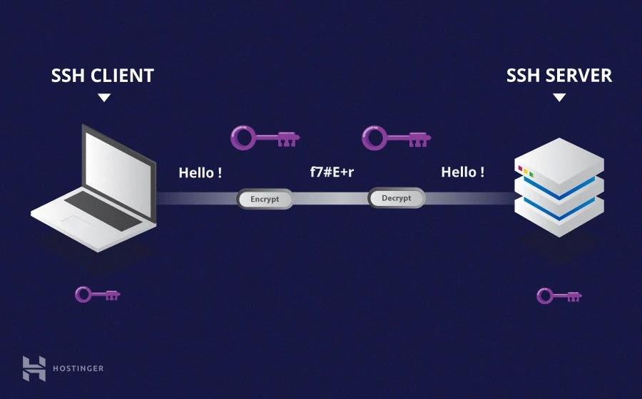

## SSH - SECURE SHELL PROTOCOL

SSH is a remote adminitration protocol that allows users to access, control and modify their remote servers over the internet.

SSH was created as a secure replacement for the unencrypted Telnet and uses cryptography to ensure that all communication to and from server happens in an encrypted manner.

Any Linux or macOS user can SSH into their remote server directly from the terminal window.

Windows users can take advantage of SSH clinets like Putty.

You can execute shell commands in the same manner as you would if you were physically operating the remote computer.

## SSH COMMAND SYNTAX

`ssh {user}#{host}` - host refers to the remote server, client is your local computer

`ssh root@244.235.23.19`

`ssh root@www.mydomain.com`

## SYMMETRIC ENCRYPTION

- symmetric encryption is a form of encryption where a secret key is used for both encryption and decryption of a message by both the client and the host

## ASSYMETRIC ENCRYPTION

- asymmetrical encryption uses two separate keys for encryption and decryption. These two keys are known as the public key and the private key. Together, both these keys form a public-private key pair.
 - public key can be used by any individual to encrypt a message and can only be decrypted by the recipient who possesses their particular private key, and vice versa.
- Unlike the general perception, asymmetrical encryption is not used to encrypt an entire SSH session. Instead, it is used during the key exchange algorithm of symmetric encryption. Before initiating a secured connection, both parties generate temporary public-private key pairs and share their respective private keys to produce the shared secret key.
- Once a secured symmetric communication has been established, the server uses the client’s public key to generate and challenge and transmit it to the client for authentication. If the client can successfully decrypt the message, it means that it holds the private key required for the connection – the SSH session then begins.

## CONNECTION

- SSH operates on TCP port 22 by default, the host listens on port 22 for incoming connections
- it organizes the secure connection by authenticating the client and opening the correct shell environment if the verification is succesful
- there are two stages to establishing a connection - first, both the systems must agree upon encryption standards to protect future communications, and second, the user must authenticate themselves

## PUTTY KEY GENERATOR

- app used to create a public-private key pair

## PUTTY

- PuTTY is an SSH client app which can be used to connect to a remote server with SSH

## PUBLIC-PRIVATE KEYS GOOD PRACTICE

- good practice is to have one public-private key per device, unless you access two different types of networks from the same device (eg. your personal project and a corporate project), then you should have two separate public-private key pairs

## WHERE IS MY PUBLIC-PRIVATE KEY PAIR STORES ON WINDOWS?

## ASSIGN PROPER PERMISSION

`chmod 600 ~/.ssh/id_rsa`

## ED25519 SSH KEYS

`C:\Users\User\.ssh`

`id_ed53487` - public key
`id_ed53487` - private key

## PPK KEYS

- these are stored wherever you want

## WHAT IS .PEM EXTENSION?

- .pem extension is Privacy Enhances Mail Certificate, is an encoded certificate file to authenticate a secure website. It may contain a private key, certificate authority (CA) server certificate

## WHAT IS .PPK EXTENSION?

- PPK is a file created by PuTTYgen (Putty Key Generator)
- it stores a private key generated by Putty Key Generator used for enabling secure communication with a remote entity that has the corresponding public key

## SSH COMMAND LINE

## SSH COMMANDS

<https://www.hostinger.com/tutorials/ssh/basic-ssh-commands>

## HOW TO USE PUTTY?

<https://www.hostinger.com/tutorials/how-to-use-putty-ssh>

## RESEARCH

<https://www.hostinger.com/tutorials/ssh-tutorial-how-does-ssh-work>

